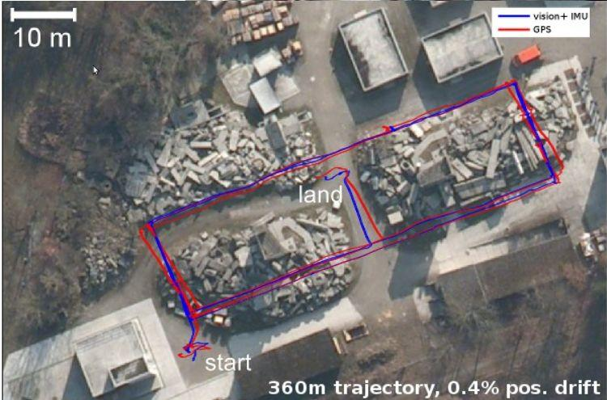
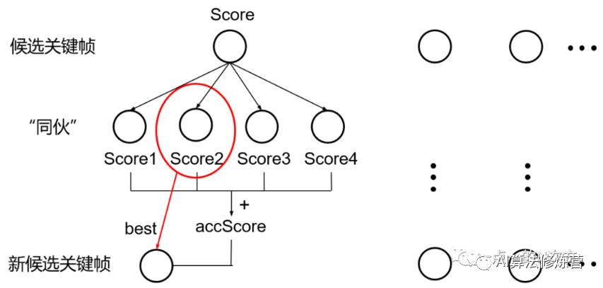
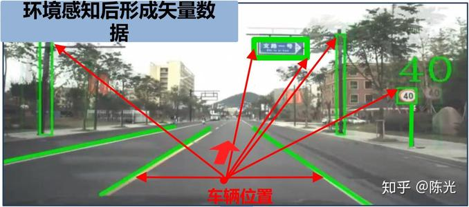
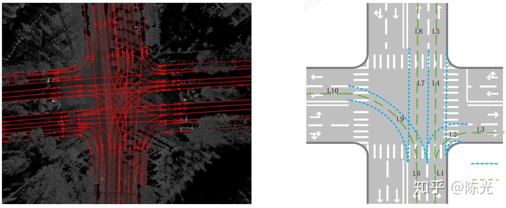
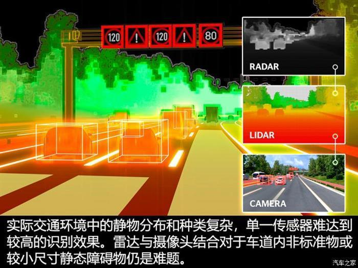
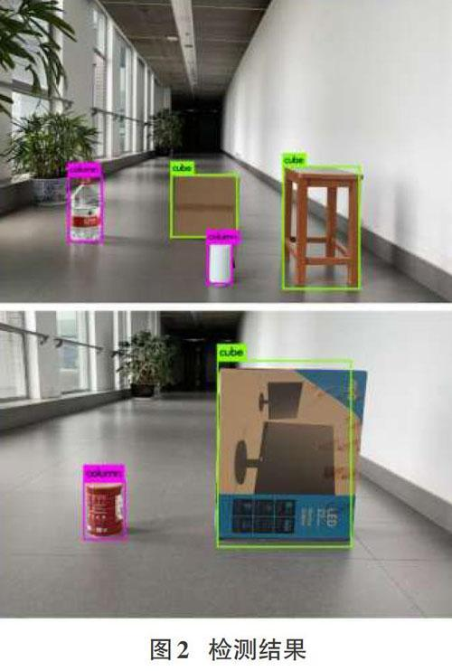

# Basic Info. 
    Jinyang Wang   王金洋  
    Master of Control Engineering, North University of China, Sep 2012 - July 2015  
    Bachelor of Process Equipment and Control Engineering, Sep 2006 - July 2010
    Email, yangyangnuc AT outlook DOT com  
    
   

# Research Interest

    My research interest includes 
Vision SLAM 
 ,    
    Object Detection and 6DOF measurement problems.

  

<table>
 <tr>  
  <td >  

    Modified version of Monocular-SLAM Based On PTAM
  
  </td>
    <td>
    </td>
    <td>
    </td>
 </tr>
 <tr>
       <td width="40%"> 
       
       </td>
       <td width="40%">
             
       </td>
        <td width = "20%">
          Jiangxin Dong and Jinshan Pan, "Physics-Based Feature Dehazing Networks", European Conference on Computer Vision (ECCV), 2020. 
        </td>
  </tr>
</table>   

------------[code](https://www.baidu.com)-------[video](https://www.yahoo.com)--------------   

----------------------------------------------------- 

<table>
  <tr>
    <td>  

    Vehicle Lane Detection Based On Particle Filter

    </td>
    <td>
    </td>
    <td>
    </td>
    

  </tr>

 <tr>
       <td width="40%"> 
       
       </td>
       <td width="40%">
             
       </td>
        <td width = "20%">
          Jiangxin Dong and Jinshan Pan, "Physics-Based Feature Dehazing Networks", European Conference on Computer Vision (ECCV), 2020. 
        </td>
  </tr>
</table>   

------------[code](https://www.baidu.com)-------[video](https://www.yahoo.com)--------------   

-----------------------------------------------------  

<table>

  <tr>
    <td>  

      Barrier Detection Based on Jordan Curve Theorem

    </td>
    <td>
    </td>
    <td>
    </td>
    

  </tr>
 <tr>
       <td width="40%"> 
       
       </td>
       <td width="40%">
             
       </td>
        <td width = "20%">
          Jiangxin Dong and Jinshan Pan, "Physics-Based Feature Dehazing Networks", European Conference on Computer Vision (ECCV), 2020. 
        </td>
  </tr>
</table>   

------------[code](https://www.baidu.com)-------[video](https://www.yahoo.com)--------------   

-----------------------------------------------------  

  

  

# Publications 

Jinshan Pan inshan Pan, Risheng Liu, Zhixun Su, and Xianfeng Gu, "Kernel Estimation from Salient Structure for Robust Motion Deblurring", Signal Processing: Image Communication, 2013.
[Project] [Paper] [MATALB code]
'